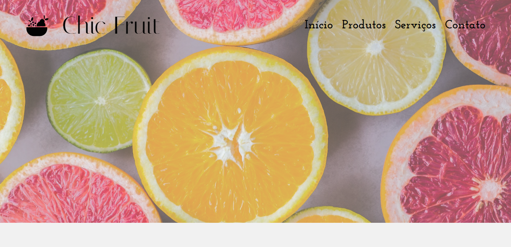

<h1 align="center"> Chic Fruit </h1>

Projeto de um hortifrutti gourmet desenvolvido como demo para projeto em grupo  

  <a href="#-tecnologias">Tecnologias</a>&nbsp;&nbsp;&nbsp;|&nbsp;&nbsp;&nbsp;
  <a href="#-deploy">Deploy</a>&nbsp;&nbsp;&nbsp;|&nbsp;&nbsp;&nbsp;
  <a href="#-english-version">English Version</a>&nbsp;&nbsp;&nbsp;&nbsp;&nbsp;&nbsp;

  

## 🚀 Tecnologias

Esse projeto foi desenvolvido com as seguintes tecnologias:

- Typescript
- TSX
- React
- ViteJS
- Styled-Components
- React Router Dom
- React Icons
- JSON Server

## 💻 Deploy

> [Clique aqui para navegar para o projeto!](https://chic-fruit-lime.vercel.app/)

## 🌎 English Version

Chic Fruit is a gourmet fruit market themed project developed to be a demo version of a project that I'm going to develop in a group. To do that, I've used:
- Typescript, TSX, React, ViteJS, Styled-Components, React Router Dom, React Icons and JSON Server

> You can check out the deploy by [clicking here](https://chic-fruit-lime.vercel.app/)

---
### Desenvolvido por Sarah Schneider 🖖